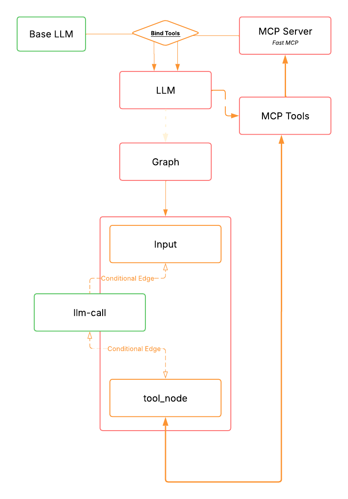

<div align="center">

# 🧮 MCP Math Agent

**A LangGraph-powered math agent with tools served via FastMCP**

[](https://python.org)
[](https://langchain-ai.github.io/langgraph/)
[](https://gofastmcp.com)
[](https://openai.com)

</div>

---

## 📖 Sobre

Um agente de matemática conversacional construído com **LangGraph** e **GPT-4o**, onde as ferramentas matemáticas são expostas via um servidor **FastMCP** independente — completamente desacoplado do agente.

O agente recebe perguntas matemáticas em linguagem natural, decide quais ferramentas usar, executa os cálculos via MCP, e responde de forma concisa.

---

## 🏗️ Arquitetura



<div align="left">
O fluxo funciona assim:

1. **Input** — lê a mensagem do usuário no terminal
2. **LLM Call** — o GPT-4o processa e decide se precisa de uma ferramenta
3. **Router** — verifica se há `tool_calls` na resposta
   - Se sim → **Tool Node** executa a ferramenta via MCP Server e volta ao LLM
   - Se não → imprime a resposta e volta ao Input


---

## 📁 Estrutura

```
.
├── mcp_server.py      # Servidor FastMCP com as ferramentas matemáticas
├── graph.py           # Grafo LangGraph + loop principal async
├── llm.py             # Inicialização do modelo e cliente MCP
├── chatbot_utils.py   # I/O no terminal com Rich
├── main.py            # Entry point (legado)
└── pyproject.toml
```

</div>

---

## 🔧 Ferramentas disponíveis

As ferramentas vivem no `mcp_server.py` e são expostas via protocolo MCP:

| Ferramenta | Descrição |
|---|---|
| `add(arg1, arg2)` | Soma dois números |
| `multiply(arg1, arg2)` | Multiplica dois números |
| `divide(arg1, arg2)` | Divide dois números (com proteção contra divisão por zero) |

---

## 🚀 Como rodar

### 1. Instalar dependências

```bash
pip install fastmcp langchain langchain-openai langchain-mcp-adapters langgraph rich python-dotenv
```

### 2. Configurar variável de ambiente

Crie um arquivo `.env` na raiz:

```env
OPENAI_API_KEY=sk-...
```

### 3. Subir o servidor MCP

```bash
python mcp_server.py
```

O servidor ficará escutando em `http://127.0.0.1:8000`.

### 4. Rodar o agente (em outro terminal)

```bash
python graph.py
```

---

## 💬 Exemplo de uso

```
Você: Quanto é 1234 vezes 56?
TOOL CALL multiply
A IA: 1234 × 56 = 69.104

Você: Divida isso por 8
TOOL CALL divide
A IA: 69.104 ÷ 8 = 8.638
```

---

## 🧠 Como funciona o MCP

O **MCP (Model Context Protocol)** é um protocolo padrão que permite LLMs se conectarem a ferramentas externas de forma agnóstica ao framework.

```
Agente (LangGraph)
    └── MultiServerMCPClient
            └── HTTP/SSE ──► mcp_server.py (FastMCP)
                                  └── add(), multiply(), divide()
```

O servidor pode estar em qualquer máquina — basta trocar a URL no cliente:

```python
# llm.py
"url": "http://sua-instancia:8000/sse"
```

---

## 📦 Dependências principais

| Pacote | Papel |
|---|---|
| `langgraph` | Orquestração do agente como grafo de estados |
| `langchain-openai` | Integração com GPT-4o |
| `fastmcp` | Servidor MCP para expor as ferramentas |
| `langchain-mcp-adapters` | Converte tools MCP em LangChain `BaseTool` |
| `rich` | Interface bonita no terminal |

---